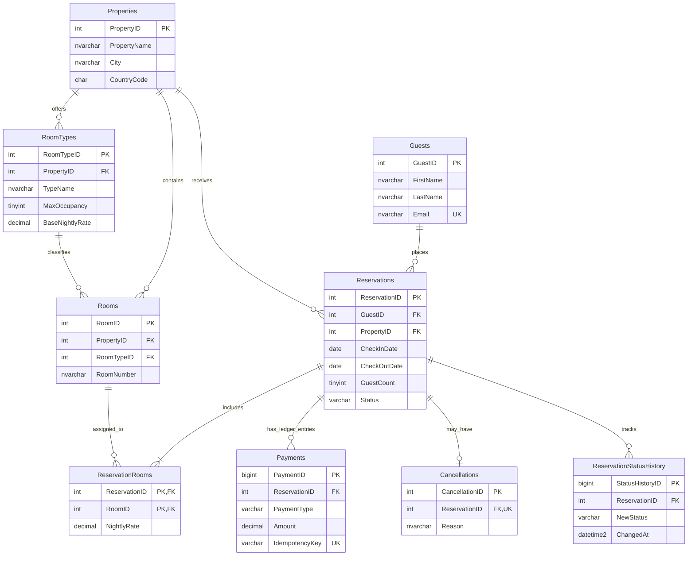

# Entity relationship diagram

```mermaid
erDiagram
    Properties ||--o{ RoomTypes : offers
    Properties ||--o{ Rooms : contains
    RoomTypes ||--o{ Rooms : classifies
    Guests ||--o{ Reservations : places
    Properties ||--o{ Reservations : receives
    Reservations ||--|{ ReservationRooms : includes
    Rooms ||--o{ ReservationRooms : assigned_to
    Reservations ||--o{ Payments : has_ledger_entries
    Reservations ||--o| Cancellations : may_have
    Reservations ||--o{ ReservationStatusHistory : tracks

    Properties {
      int PropertyID PK
      nvarchar PropertyName
      nvarchar City
      char CountryCode
    }
    RoomTypes {
      int RoomTypeID PK
      int PropertyID FK
      nvarchar TypeName
      tinyint MaxOccupancy
      decimal BaseNightlyRate
    }
    Rooms {
      int RoomID PK
      int PropertyID FK
      int RoomTypeID FK
      nvarchar RoomNumber
    }
    Guests {
      int GuestID PK
      nvarchar FirstName
      nvarchar LastName
      nvarchar Email UK
    }
    Reservations {
      int ReservationID PK
      int GuestID FK
      int PropertyID FK
      date CheckInDate
      date CheckOutDate
      tinyint GuestCount
      varchar Status
    }
    ReservationRooms {
      int ReservationID PK,FK
      int RoomID PK,FK
      decimal NightlyRate
    }
    Payments {
      bigint PaymentID PK
      int ReservationID FK
      varchar PaymentType
      decimal Amount
      varchar IdempotencyKey UK
    }
    Cancellations {
      int CancellationID PK
      int ReservationID FK,UK
      nvarchar Reason
    }
    ReservationStatusHistory {
      bigint StatusHistoryID PK
      int ReservationID FK
      varchar NewStatus
      datetime2 ChangedAt
    }
```
